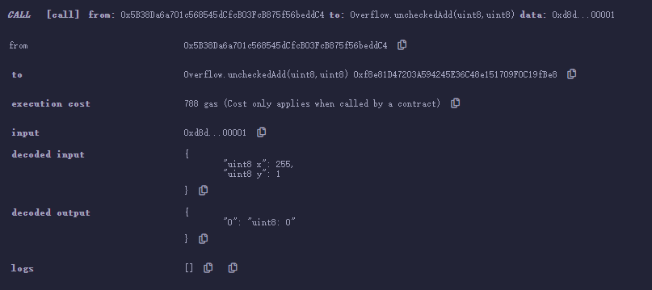
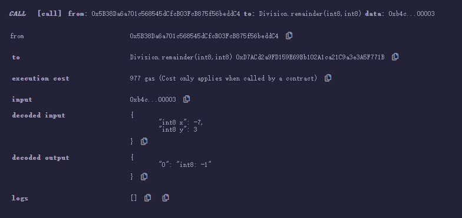
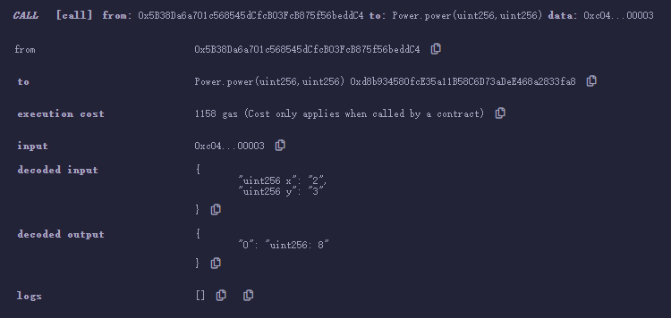

# Solidity 基础语法 - 变量和类型

Solidity 是一种静态类型语言，这意味着每个变量（状态变量和局部变量）都需要在编译时指定变量的类型。Solidity 提供了几种基本类型，并且基本类型可以用来组合出复杂类型。除此之外，类型之间可以在包含运算符号的表达式中进行交互。

## Solidity 最基础语法

Solidity 的源文件以 `.sol` 为后缀，使用 UTF-8 编码。

Solidity 源文件的第一行通常是一个版本声明，用来指定编译器的版本。例如：

```solidity
// SPDX-License-Identifier: MIT
pragma solidity ^0.8.0;
```

第一行是一个特殊的注释，用来指定源代码的许可证。这是为了遵循 [SPDX 规范](https://spdx.org/)，方便代码共享和重用。

第二行是一个 `pragma` 指令，用来告诉编译器只有在版本为 0.8.x 的情况下才能编译该文件。`^` 表示“或更高版本”，但不包括下一个主版本。也就是说，`^0.8.0` 等同于 `>=0.8.0 <0.9.0`。

Solidity 中有两种注释风格：单行注释以 `//` 开始，多行注释以 `/*` 开始，以 `*/` 结束。

Solidity 中的语句以分号 `;` 结尾。

Solidity 中的代码组织在合约（contract）中。合约类似于面向对象编程中的类，可以包含状态变量、函数、事件、结构体、枚举等元素。合约通过 `contract` 关键字定义，后面跟着合约的名称和大括号 `{}` 包含的合约体。例如：

```solidity
contract HelloWorld {
    // 合约体
}
```

要让合约能输出 "Hello World"，我们需要在合约体中定义一个函数，函数通过 `function` 关键字定义，后面跟着函数名、参数列表、返回值列表和函数体。例如：

```solidity
function greet() public pure returns (string memory) {
    return "Hello World";
}
```

这个函数叫做 `greet` ，它没有参数，返回一个字符串类型的值。它有三个修饰符：`public` 表示这个函数可以被外部调用；`pure` 表示这个函数不会读写合约的状态变量；`memory` 表示返回值是一个内存变量，不会永久保存在存储中。

要调用这个函数，我们需要部署合约到区块链上，并且发送一个交易给它。部署和交互合约的方法有很多，这里我们使用一个在线的 IDE 叫做 Remix 来演示。

## 变量和类型

Solidity 中有两种变量：状态变量和局部变量。状态变量是永久存储在合约存储中的变量，它们可以在合约内的函数之间共享和传递值。局部变量是临时存储在内存中的变量，它们只能在函数内部使用。

Solidity 是一种静态类型语言，这意味着每个变量都需要在编译时指定变量的类型。Solidity 提供了几种基本类型，并且基本类型可以用来组合出复杂类型。

### 值类型

以下类型也称为值类型，因为这些类型的变量将始终按值来传递。也就是说，当这些变量被用作函数参数或者用在赋值语句中时，总会进行值拷贝。

#### 布尔类型

`bool`：可能的取值为字面常量值 `true` 和 `false`。

运算符：

- `!` （逻辑非）
- `&&` （逻辑与， “and” ）
- `||` （逻辑或， “or” ）
- `==` （等于）
- `!=` （不等于）

运算符 `||` 和 `&&` 都遵循同样的短路（ short-circuiting ）规则。就是说在表达式 `f(x) || g(y)` 中， 如果 `f(x)` 的值为 `true` ，那么 `g(y)` 就不会被执行，即使会出现一些副作用。

#### 整型

`int / uint` ：分别表示有符号和无符号的不同位数的整型变量。

支持关键字 `uint8` 到 `uint256` （无符号，从 8 位到 256 位）以及 `int8` 到 `int256` ，以 8 位为步长递增。

`uint` 和 `int` 分别是 `uint256` 和 `int256` 的别名。

运算符：

- 比较运算符： `<=` ， `<` ， `==` ， `!=` ， `>=` ， `>` （返回布尔值）
- 位运算符： `&` ， `|` ， `^` （异或）， `~`（位取反）
- 移位运算符： `<<`（左移位） ，`>>` （右移位）
  - 算数运算符： `+` ， `-` ， 一元运算负 `-` （仅针对有符号整型）， `*` ， `/` ， `%` （取余或叫模运算） ， `**`（幂）

对于整形 X ，可以使用 type (X).min 和 type (X).max 去获取这个类型的最小值与最大值。警告Solidity中的整数是有取值范围的。例如 uint32 类型的取值范围是 0 到 2 ** 32-1 。0.8.0 开始，算术运算有两个计算模式：一个是 “wrapping”（截断）模式或称 “unchecked”（不检查）模式，一个是”checked” （检查）模式。默认情况下，算术运算在 “checked” 模式下，即都会进行溢出检查，如果结果落在取值范围之外，调用会通过 失败异常 回退。你也可以通过 unchecked { ... } 切换到 “unchecked”模式。

##### 比较运算

比较整型的值

##### 位运算

位运算在数字的二进制补码表示上执行。这意味着： ~int256（0）== int256（-1） 。

##### 移位

移位操作的结果具有左操作数的类型，同时会截断结果以匹配类型。右操作数必须是无符号类型。尝试按带符号的类型移动将产生编译错误。移位可以通过用2的幂的乘法来 “模拟” (方法如下)。请注意，左操作数的截断总是在最后发生，但是不会明确提醒x << y 等于数学表达式 x * 2 ** y 。x >> y 等于数学表达式 x / 2 ** y ， 四舍五入到负无穷。在版本 0.5.0 之前，对于负 x 的右移 x >> y 相当于 x / 2 ** y ，会四舍五入到零，而不是向负无穷大。对于移位操作不会像算术运算那样执行溢出检查，其结果总是被截断。

##### 加、减、乘法运算

加法，减法和乘法和通常理解的语义一样，不过有两种模式来应对溢出（上溢及下溢）：默认情况下，算术运算都会进行溢出检查，但是也可以禁用检查，可以通过 unchecked block 来禁用检查，此时会返回截断的结果。例如：

```solidity
// SPDX-License-Identifier: MIT
pragma solidity ^0.8.0;

contract Overflow {
    function add(uint8 x, uint8 y) public pure returns (uint8) {
        return x + y;
    }

    function uncheckedAdd(uint8 x, uint8 y) public pure returns (uint8) {
        unchecked {
            return x + y;
        }
    }
}
```

如果我们调用 `add(255, 1)` ，它会回退并消耗所有 gas ，因为结果超出了 uint8 的最大值 255 。但是如果我们调用 `uncheckedAdd(255, 1)` ，它会返回 0 ，因为结果被截断为低 8 位。



##### 除法和取余运算

除法和取余运算和通常理解的语义一样，但是需要注意以下几点：

- 如果除数为零或者被除数小于除数，则结果为零。
- 对于有符号整型，除法总是向零舍入。
- 对于有符号整型，取余运算的符号和被除数相同。

例如：

```solidity
// SPDX-License-Identifier: MIT
pragma solidity ^0.8.0;

contract Division {
    function divide(uint8 x, uint8 y) public pure returns (uint8) {
        return x / y;
    }

    function remainder(int8 x, int8 y) public pure returns (int8) {
        return x % y;
    }
}
```

如果我们调用 `divide(7, 2)` ，它会返回 3 ，因为结果向零舍入。如果我们调用 `remainder(-7, 3)` ，它会返回 -1 ，因为结果的符号和被除数相同。




##### 幂运算

幂运算使用 `**` 运算符表示，它遵循右结合规则。也就是说，在表达式 `x**y**z` 中，先计算 `y**z` 再计算 `x**(y**z)` 。例如：

```solidity
// SPDX-License-Identifier: MIT
pragma solidity ^0.8.0;

contract Power {
    function power(uint x, uint y) public pure returns (uint) {
        return x ** y;
    }
}
```

如果我们调用 `power(2, 3)` ，它会返回 8 ，因为结果等于 `2 * 2 * 2` 。如果我们调用 `power(2, power(3, 2))` ，它会返回 512 ，因为结果等于 `2 ** (3 ** 2)` 即 `2 ** 9` 。



#### 固定点数

`fixed / ufixed` ：分别表示有符号和无符号的不同位数和小数位数的固定点数变量。

支持关键字 `fixedMxN` 和 `ufixedMxN` ，其中 M 表示总位数，N 表示小数位数。M 和 N 的取值范围都是 8 到 256 ，且必须是 8 的倍数。例如，`fixed32x8` 表示一个有符号的固定点数，总共有 32 位，其中 8 位是小数部分。

`fixed` 和 `ufixed` 分别是 `fixed128x18` 和 `ufixed128x18` 的别名。

Solidity 目前还不完全支持固定点数。它们可以被声明，但不能被赋值或从赋值。

**注:**

固定点数的乘法和除法会自动进行舍入，以保持结果的小数位数与操作数相同。

例如：

```solidity
// SPDX-License-Identifier: MIT
pragma solidity ^0.8.0;

contract FixedPoint {
    function multiply(ufixed x, ufixed y) public pure returns (ufixed) {
        return x * y;
    }

    function divide(ufixed x, ufixed y) public pure returns (ufixed) {
        return x / y;
    }
}
```

**注：**

尝试运行会UnimplementedFeatureError: Fixed point types not implemented. , 原因上方已经提及它们可以被声明，但不能被赋值或从赋值。所以如果要使用，可以使用一些库来处理固定点数的运算，例如 ABDK Math 64.64，或者自己实现一个自定义的 UFixed 类型，接下来我会自己实现一个UFixed类：

```solidity
// SPDX-License-Identifier: MIT
pragma solidity ^0.8.0;

// 定义一个基于 uint256 的自定义类型 UFixed
type UFixed is uint256;

// 一个用于在 UFixed 类型上进行算术运算的库
library UFixedMath {
    // UFixed 类型的小数位数
    uint constant decimals = 18;

    // UFixed 类型的乘数
    uint constant multiplier = 10**decimals;

    // 加法运算，溢出时回滚
    function add(UFixed a, UFixed b) internal pure returns (UFixed) {
        return UFixed.wrap(UFixed.unwrap(a) + UFixed.unwrap(b));
    }

    // 乘法运算，溢出时回滚
    function mul(UFixed a, UFixed b) internal pure returns (UFixed) {
        // 使用 mulDiv 来处理小数位数
        return UFixed.wrap(mulDiv(UFixed.unwrap(a), UFixed.unwrap(b), multiplier));
    }

    // 除法运算，除以零时回滚
    function div(UFixed a, UFixed b) internal pure returns (UFixed) {
        // 使用 mulDiv 来处理小数位数
        return UFixed.wrap(mulDiv(UFixed.unwrap(a), multiplier, UFixed.unwrap(b)));
    }

    // 一个辅助函数，用于进行带有正确舍入的乘法和除法运算
    function mulDiv(
        uint x,
        uint y,
        uint z
    ) internal pure returns (uint) {
        // Solidity 只在除以零时自动断言
        require(z > 0, "UFixedMath: division by zero");
        // 确保结果小于 2^256，否则会溢出
        require(x <= type(uint).max / y, "UFixedMath: multiplication overflow");

        uint a = x * y;
        uint b = a / z;
        uint c = a % z;
        if (c * 2 >= z) {
            // 向上舍入，加一
            return b + 1;
        } else {
            // 向下舍入，截断
            return b;
        }
    }
}

contract FixedPoint {
    using UFixedMath for UFixed;

    function multiply(UFixed x, UFixed y) public pure returns (UFixed) {
        return x.mul(y);
    }

    function divide(UFixed x, UFixed y) public pure returns (UFixed) {
        return x.div(y);
    }
}
```

**注：**

**wrap** 和 **unwrap** 函数是用于在自定义类型和基础类型之间进行转换的。自定义类型是一种基于某个内置类型（例如 **uint256**）的抽象类型，它可以提高类型安全性和可读性。例如，我们可以定义一个自定义类型 **UFixed** 来表示一个带有小数位数的无符号整数：

```solidity
// 定义一个基于 uint256 的自定义类型 UFixed
type UFixed is uint256;
```

这样，我们就可以使用 **UFixed.wrap** 函数来把一个 **uint256** 类型的值转换为一个 **UFixed** 类型的值。例如：

```solidity
uint256 a = 123;
UFixed b = UFixed.wrap(a); // b 是一个 UFixed 类型的值
```

同样，我们也可以使用 **UFixed.unwrap** 函数来把一个 **UFixed** 类型的值转换为一个 **uint256** 类型的值。例如：

```solidity
UFixed c = UFixed.wrap(456);
uint256 d = UFixed.unwrap(c); // d 是一个 uint256 类型的值
```

这样，我们就可以在需要的时候在两种类型之间进行转换，而不会改变它们的数据表示。请注意，自定义类型没有任何操作符或成员函数，所以我们不能直接对它们进行算术运算或比较运算。我们需要使用库或者其他方法来实现这些功能。

#### 地址类型

`address` ：表示一个 20 字节的以太坊地址。

地址类型有两种变体：`address` 和 `address payable` 。前者只能用于查询地址的余额和代码，后者可以用于发送以太币和调用合约函数。

地址类型的变量可以通过字面量或者显式转换来赋值。例如：

```solidity
// SPDX-License-Identifier: MIT
pragma solidity ^0.8.0;

contract Address {
    address public owner = 0xCA35b7d915458EF540aDe6068dFe2F44E8fa733c; // 字面量
    address payable public receiver = payable(owner); // 显式转换
}
```

地址类型的变量有一些成员方法，可以用来查询地址的信息或者与之交互。例如：

- `<address>.balance` （uint256）：返回地址的余额（单位为 wei ）。
- `<address>.code` （bytes memory）：返回地址的代码（如果有的话）。
- `<address>.codehash` （bytes32）：返回地址的代码哈希（如果有的话）。
- `<address payable>.transfer(uint256 amount)` ：向地址发送给定数量的以太币（单位为 wei ），如果失败则回退。
- `<address payable>.send(uint256 amount) returns (bool)` ：向地址发送给定数量的以太币（单位为 wei ），如果失败则返回 false 。
- `<address>.call(...) returns (bool, bytes memory)` ：向地址发起低级别的 CALL ，返回是否成功和返回数据。
- `<address>.delegatecall(...) returns (bool, bytes memory)` ：向地址发起低级别的 DELEGATECALL ，返回是否成功和返回数据。
- `<address>.staticcall(...) returns (bool, bytes memory)` ：向地址发起低级别的 STATICCALL ，返回是否成功和返回数据。

**注：**

CALL，DELEGATECALL，STATICCALL是Solidity中的三种合约调用方式，它们都是通过消息调用来进行，而不是直接的代码跳转。它们的区别如下：

- CALL是最常见的合约调用方式，它会修改被调用者的存储空间，而不影响调用者的存储空间。它也会传递msg.sender和msg.value给被调用者。
- DELEGATECALL类似于CALL，但是它会修改调用者的存储空间，而不影响被调用者的存储空间。它也会保持msg.sender和msg.value不变，即使用原始调用者的地址和发送的金额。
- STATICCALL与DELEGATECALL类似，但是它只能调用view或pure类型的函数，即不能修改任何状态变量。它也会保持msg.sender和msg.value不变。

低级别的CALL，DELEGATECALL，STATICCALL是指使用低级别API来直接操作地址而不是合约实例。它们分别对应于call，callcode，delegatecall和staticcall这四个函数。它们的区别如下：

- call与CALL类似，但是它不会检查被调用地址是否存在或是否有代码，也不会抛出异常，而是返回一个布尔值表示成功或失败。
- callcode与call类似，但是它与DELEGATECALL类似地修改调用者的存储空间。这个函数已经被弃用，不建议使用。
- delegatecall与DELEGATECALL类似，但是它不会检查被调用地址是否存在或是否有代码，也不会抛出异常，而是返回一个布尔值表示成功或失败。
- staticcall与STATICCALL类似，但是它不会检查被调用地址是否存在或是否有代码，也不会抛出异常，而是返回一个布尔值表示成功或失败。

以下是一个输出示例：

| 调用方式 | 存储空间 | msg.sender | msg.value | 异常处理 |
| --- | --- | --- | --- | --- |
| CALL | 被调用者 | 调用者 | 调用者 | 抛出  |
| DELEGATECALL | 调用者 | 原始调用者 | 原始调用者 | 抛出  |
| STATICCALL | 无修改 | 原始调用者 | 原始调用者 | 抛出  |
| call | 被调用者 | 调用者 | 调用者 | 返回  |
| callcode（弃用） | 调用者 | 调用者 | 调用者 | 返回  |
| delegatecall | 调用者 | 原始调用者 | 原始调用者 | 返回  |
| staticcall | 无修改 | 原始调用者 | 原始调用者 | 返回  |

```solidity
// SPDX-License-Identifier: MIT
pragma solidity ^0.8.0;

contract Address {
    function getBalance(address account) public view returns (uint256) {
        return account.balance;
    }

    function getCode(address account) public view returns (bytes memory) {
        return account.code;
    }

    function getCodeHash(address account) public view returns (bytes32) {
        return account.codehash;
    }

    function sendEther(address payable recipient, uint256 amount) public payable {
        require(msg.value >= amount, "Insufficient funds");
        recipient.transfer(amount);
    }

    function callContract(address contractAddress, bytes memory data) public returns (bool, bytes memory) {
        return contractAddress.call(data);
    }
}
```

如果我们调用 `getBalance(0xCA35b7d915458EF540aDe6068dFe2F44E8fa733c)` ，它会返回该地址的余额。如果我们调用 `getCode(0xCA35b7d915458EF540aDe6068dFe2F44E8fa733c)` ，它会返回该地址的代码（如果是合约地址）。如果我们调用 `getCodeHash(0xCA35b7d915458EF540aDe6068dFe2F44E8fa733c)` ，它会返回该地址的代码哈希（如果是合约地址）。如果我们调用 `sendEther(0xCA35b7d915458EF540aDe6068dFe2F44E8fa733c, 1 ether)` ，它会向该地址发送 1 ether 。如果我们调用 `callContract(0xCA35b7d915458EF540aDe6068dFe2F44E8fa733c, data)` ，它会向该地址发起一个 CALL ，其中 data 是要传递的数据。